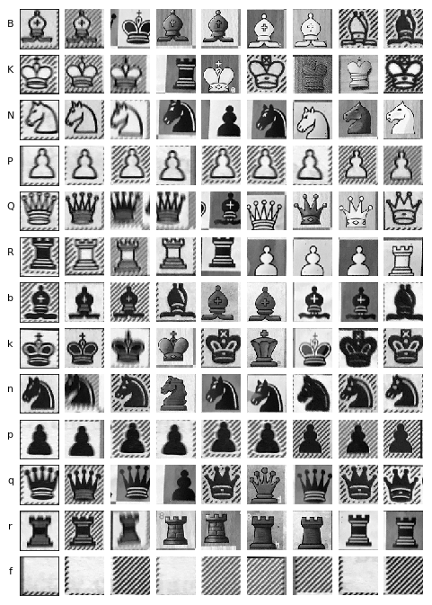

# Chess Vision - a computer vision chess project

This repository contains code and resources for extracting chess positions from images using computer vision.

18/6/2018: WORK IN PROGRESS!

## Example

From *any* square input image (png, jpg, etc.), such as this one:

the ChessVision algorithm recognizes, extracts, and classifies any chessboard contained in the image.

Two generations of the ChessVision algorithm give the following two outputs to the example above

    
    

## Earlier work

Several solutions to the chess-extraction-and-classification problem have been posed. Most rely on a combination of computer vision and machine learning, however, many different approaches are possible.

The following two links point to internet discussions about the problem at hand

+ https://www.chess.com/forum/view/endgames/convert-pngimage-file-to-pgn-or-fen
+ https://www.reddit.com/r/chess/comments/856pjh/is_there_a_way_to_get_a_fen_from_an_image_of_the/

The next links point to existing implementations

+ [chessputzer](https://github.com/metterklume/chessputzer) [(try)](https://www.ocf.berkeley.edu/~abhishek/putz/run.fcgi/upload)
+ ChessFigRdrLite - http://www.kgrothapps.com/
+ [chessgrabber](http://www.chessgrabber.nicolaas.net/)
+ [tensorflow_chessbot](https://github.com/Elucidation/tensorflow_chessbot)
+ [chessify](https://chessify.me/)

## ChessVision

The goal of ChessVision is to be able to correctly classify as many as possible different, valid inoputs. Already the performance of the algorithm is not very bad. Since ChessVision is based on machine learning, in particular deep learning, the hope is that the performance of ChessVision will improve as more training data comes in.

## Algorithm details

### Board extraction

The first step is to extact square chessboards from raw photographs, the following plot shows the algorithms performance on a batch of test data. 

Board extraction is done in two steps, first the image is resized to 256x256 and fed into a deep convolutional neural network (the [unet](https://github.com/zhixuhao/unet) architecture) upon which a mask is produced, labelling each pixel as either chessboard, or not a chessboard. Next, a contour approximation algorithm approximates the mask using four points. The board is extracted from the raw image using these four points, appropriately scaled. The next image illustrates the trained models performance on a batch of training data. 

### Board classification

The next step is to cut the board image into 64 little 64x64-pixel squares, with accompanying square-names, in order to take into account board orientation. We classify squares using a small convolutional network trained on a hand-collected, hand-labelled dataset.

The performance of the current generation of ChessVision is excellent, the next image shows the performance on a batch of training data. 

However, on unseen test data the algorithm fares worse, as the following figure shows. 

## Todo:

- fix 2-model bug (theano kinda fixes)
  - https://github.com/keras-team/keras/issues/2397
- come up with best deployment model
  - https://github.com/llSourcell/how_to_deploy_a_keras_model_to_production/blob/master/app.py
  - https://medium.com/@burgalon/deploying-your-keras-model-35648f9dc5fb
  - https://gitlab.com/fast-science/background-removal-server
  - https://blog.keras.io/building-a-simple-keras-deep-learning-rest-api.html
  - https://github.com/mtobeiyf/keras-flask-deploy-webapp

- Position Logic Checks
  - no more than two knights, bishops, rooks, kings
  - not pawn on first rank

- Recognize board rotation state! 
- Crop/resize user upload image
- UI - status/progress, hidden fields,  

## Some references

+ https://github.com/ChessCV/chess
+ http://cvgl.stanford.edu/teaching/cs231a_winter1415/prev/projects/chess.pdf
+ http://www.raspberryturk.com/details/vision.html
+ http://vision.soic.indiana.edu/b657/sp2016/projects/rkanchib/paper.pdf
+ http://indigenousengineering.com/index.php/16-ie-project/10-extract-chess-position-from-an-image-using-image-processing-algorithms
+ https://vision.fe.uni-lj.si/cvww2016/proceedings/papers/21.pdf
+ https://ieeexplore.ieee.org/document/489004/
+ https://arxiv.org/pdf/1708.03898.pdf
+ https://ieeexplore.ieee.org/document/5967178/
+ https://web.stanford.edu/class/ee368/Project_Spring_1415/Reports/Danner_Kafafy.pdf

+ https://towardsdatascience.com/estimating-optimal-learning-rate-for-a-deep-neural-network-ce32f2556ce0

