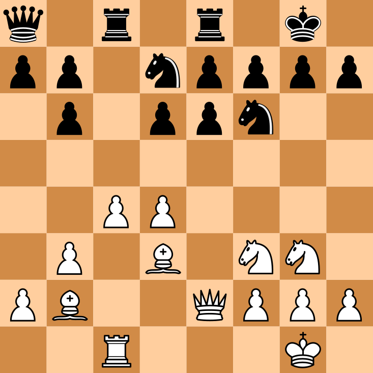
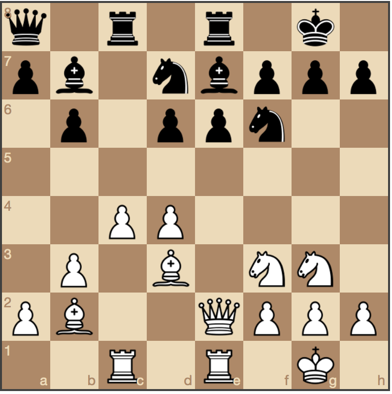

# Chess Vision - a computer vision chess project

This repository contains code and resources for extracting chess positions from images using computer vision.

18/6/2018: WORK IN PROGRESS!

## Example

This is what the program does:

<p float="left">
  <div>
    <span>Raw input:</span>
    
  </div>
  <div>
  <span>First generation models:</span>
    
  </div>
  <div>
  <span>Second generation models:</span>
    
  </div>
</p>


## Project Structure

- chessvision
- data
- webroot (also seperate git repo)
- computeroot

### Architecture 

2 nodes: 
  - web node (serves static content)
  - compute node (handles POST requests to classify boards)

## Algorithm details

CPU: 593s 49s/step
GPU: 167s 13s/step

almost 4x faster training.

### Board extraction

Step 1 is to extract square chessboards from raw photographs of chess positions.

The command

```python board_extractor.py -d <indirname> -o <outdirname>```

populates the directory __outdirname__ with extracted board images. 


### Square extraction

Square extraction is simply done by cutting the board images into 64 equal sized sub-images. 
Running 

```python extract_squares.py```

in the __src__ directory populates __data/squares__ with square images.


### Square classification


We classify squares by retraining a pretrained CNN on a hand-labelled dataset.

There are 12 different pieces on a chess board. They are:

  white: R, N, B, Q, K, P 
  black: r, n, b, q, k, p 

In addition, any square can be free (f).
Any piece can be posted on a white (w) or dark (d) square.

If we do not take into account square color, this turns out to be 13 classes.

The script ```hand_labeller.py``` lets the user hand-label every square image in the accumulated dataset into one of the 13 categories. It does something of the following:

Forever:
    show image
    wait for user-input... 
    record label

After labelling, we can train a convolutional neural network to classify the squares. To train the network and save it as a model file, run

```python square_classifyer.py```

Running 

```python classify_boards.py``` 

in the __src__ directory classifies all the extracted board images and outputs svg files of the chess position.

## Deployment Data Flow:

As more user data is uploaded to the compute node, the data is stored to further improve the models
The compute node follows roughly the following flow on user upload and user feedback

On new image: POST {file: "..."} to /cv_algo (checked on frontend)
  - give image unique_id
  - extract board
  if success:
    - save raw in ./user_uploads/raw_success/
  else:
    - save raw in ./user_uploads/raw_fail/
    - return {error: "msg"} to user
  - classify pieces (+ logic)
  - return {result: "fen", id: "..."} to user (front end produces feedback button)
  - save board in ./user_uploads/unlabelled/boards/
  - save predictions in ./user_uploads/unlabelled/predictions/ (same id + .json)

On new feedback event: POST to /feedback {id: "...", correct: true}
  if correct:
    - save all squares in board from ./user_uploads/unlabelled/boards/id to ./user_uploads/squares/<b, n, ...>/
  else: 
    - copy board from ./user_uploads/unlabelled/boards/id ./user_uploads/fail/boards/id
    - copy prediction from ./user_uploads/unlabelled/predictions/id ./user_uploads/fail/predictions/id
    - delete board from ./user_uploads/unlabelled/boards/id

## Todo:

- make endpoint for mask viewing

- fix 2-model bug (theano kinda fixes)
  - https://github.com/keras-team/keras/issues/2397
  - https://github.com/llSourcell/how_to_deploy_a_keras_model_to_production/blob/master/app.py
  - https://medium.com/@burgalon/deploying-your-keras-model-35648f9dc5fb
  - https://gitlab.com/fast-science/background-removal-server
  - https://blog.keras.io/building-a-simple-keras-deep-learning-rest-api.html
  - https://github.com/mtobeiyf/keras-flask-deploy-webapp


Position Logic Checks
- most likely king
- bishop on color
- not pawn on first rank

- more piece imgs from test data
- more raw imgs to retrain mask-cnn

- more robust contour approximation (filter by area)
  - http://cs.joensuu.fi/~koles/approximation/Ch3_3.html
  - https://github.com/geissdoerfer/polyprox

- Recognize board rotation state! 
- Crop/resize user upload image

- UI - status/progress, hidden fields,  

## Some references

+ https://github.com/ChessCV/chess
+ http://cvgl.stanford.edu/teaching/cs231a_winter1415/prev/projects/chess.pdf
+ http://www.raspberryturk.com/details/vision.html
+ http://vision.soic.indiana.edu/b657/sp2016/projects/rkanchib/paper.pdf
+ http://indigenousengineering.com/index.php/16-ie-project/10-extract-chess-position-from-an-image-using-image-processing-algorithms
+ https://vision.fe.uni-lj.si/cvww2016/proceedings/papers/21.pdf
+ https://ieeexplore.ieee.org/document/489004/
+ https://arxiv.org/pdf/1708.03898.pdf
+ https://ieeexplore.ieee.org/document/5967178/
+ https://web.stanford.edu/class/ee368/Project_Spring_1415/Reports/Danner_Kafafy.pdf


+ https://towardsdatascience.com/estimating-optimal-learning-rate-for-a-deep-neural-network-ce32f2556ce0
