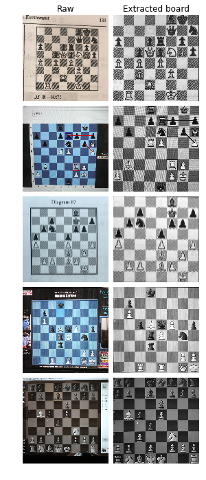
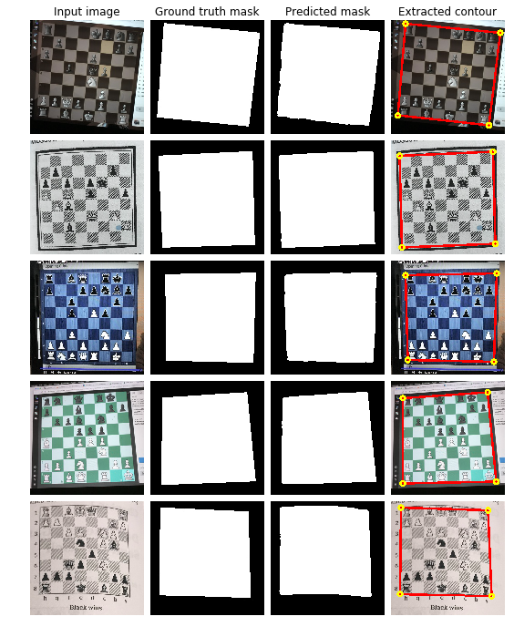
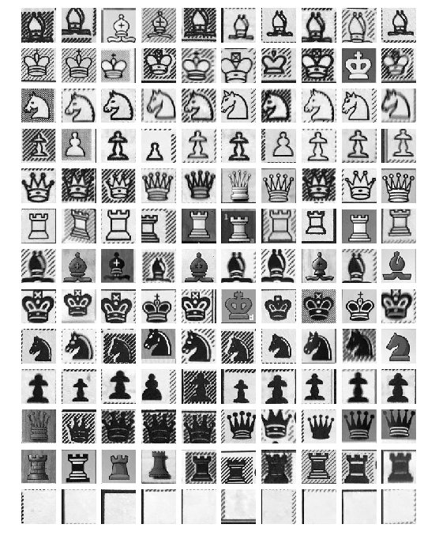

# Chess Vision - a computer vision chess project

> **Note**: This project has moved to [ChessVision-3LC](https://github.com/gudbrandtandberg/ChessVision-3LC)

This repository contains code and resources for extracting chess positions from images using computer vision.

## Try it

The app is sometimes up and running, if you're lucky you can try it out at
[chessvision.net](http://chessvision.net).

## Example

From *any* square input image, the ChessVision algorithm extracts and classifies any chessboard contained in the image.

<p float="left">
    
    
</p>

## Earlier work

Several solutions to the chess-extraction-and-classification problem have been posed. Most rely on a combination of computer vision and machine learning, however, many different approaches are possible.

The following two links point to internet discussions about the problem

+ https://www.chess.com/forum/view/endgames/convert-pngimage-file-to-pgn-or-fen
+ https://www.reddit.com/r/chess/comments/856pjh/is_there_a_way_to_get_a_fen_from_an_image_of_the/

The next links point to existing implementations

+ [chessputzer](https://github.com/metterklume/chessputzer) [(try)](https://www.ocf.berkeley.edu/~abhishek/putz/run.fcgi/upload)
+ [ChessFigRdrLite](http://www.kgrothapps.com/)
+ [chessgrabber](http://www.chessgrabber.nicolaas.net/)
+ [tensorflow_chessbot](https://github.com/Elucidation/tensorflow_chessbot)
+ [chessify](https://chessify.me/)
+ [chessocr](https://github.com/npcardoso/chessocr)

## ChessVision

The goal of ChessVision is to be able to correctly classify as many as possible different inputs. Since ChessVision is based on machine learning, in particular deep learning, the hope is that the performance of ChessVision will improve as more training data comes in.

We impose as few constraints on the inputs as possible, in principle any photograph of a 2D representation of a chess board should be identifyable by the algorithm. In particular, different formats such as books, screenshots, photos of screens, etc. should be allowable, under any lighting and small scale and rotational deviations. However, the input image must be square, at least 512 pixels wide, and contain exactly one chessboard filling at least 35% of the image area.

The current performance of the best models can be evaluated in this [notebook](./chessvision/notebooks/Performance&#32;Report.ipynb).

## Algorithm details

### Board extraction

The first step is to extact square chessboards from raw photographs, the following plot shows the algorithms performance on a batch of test data. 



Board extraction is done in two steps, first the image is resized to 256x256 and fed into a deep convolutional neural network (the [unet](https://github.com/zhixuhao/unet) architecture) after which a heatmap is produced, estimating the probability that each pixel is part of a chessboard. The heatmap is then converted to a binary mask using a simple thresholding operator. Next, a contour approximation algorithm approximates the mask using four points. The board is extracted from the raw image using these four points. The next image illustrates the trained model's performance on a batch of training data. 



#### Training

The `u_net` model is quite large (approx 35M parameters) and takes quite a while to train (approx 6 hours from scratch on a high performance GPU). In order to train this network from a relatively small training set, image augmentation is used. This [notebook](./chessvision/notebooks/View&#32;Board&#32;Extraction&#32;Training&#32;Data.ipynb) shows what a batch of training data looks like and is useful for evaluating the current augmentation scheme.  

### Board classification

The next step is to cut the board image into 64 little 64x64-pixel squares, with accompanying square-names (in order to account for board orientation). We classify squares using a small convolutional network.

The performance of the current generation of square classifiers is promising; the next image shows the results on a batch of training data (99.6% accuracy)



## Install

Prerequisites: MacOS or Linux with anaconda and conda installed

First, download this repository:

```
git clone https://github.com/gudbrandtandberg/ChessVision
cd ChessVision
```

Next, run

`./install.sh`

to create a python environment named `chessvision` and install all the dependencies.

To use chessvision, add the following to your `~/.bash_profile`:

```
export CVROOT="<path-to-ChessVision-folder>"
export PYTHONPATH=$PYTHONPATH:$CVROOT/chessvision/
export PYTHONPATH=$PYTHONPATH:$CVROOT/chessvision/model/
export PYTHONPATH=$PYTHONPATH:$CVROOT/chessvision/data_processing/
export PYTHONPATH=$PYTHONPATH:$CVROOT/chessvision/training/
```

and run 

`source ~/.bash_profile`.

Now open two terminal windows and activate the `chessvision` environment: `source activate chessvision`.

After running 

``` 
cd computeroot
python cv_endpoint.py --local
````

and 

```
cd webroot
python main.py --local
```

the ChessVision web server will be listening on `localhost:5000/`. Enjoy!

## References

+ https://github.com/ChessCV/chess
+ http://cvgl.stanford.edu/teaching/cs231a_winter1415/prev/projects/chess.pdf
+ http://www.raspberryturk.com/details/vision.html
+ http://vision.soic.indiana.edu/b657/sp2016/projects/rkanchib/paper.pdf
+ http://indigenousengineering.com/index.php/16-ie-project/10-extract-chess-position-from-an-image-using-image-processing-algorithms
+ https://vision.fe.uni-lj.si/cvww2016/proceedings/papers/21.pdf
+ https://ieeexplore.ieee.org/document/489004/
+ https://arxiv.org/pdf/1708.03898.pdf
+ https://ieeexplore.ieee.org/document/5967178/
+ https://web.stanford.edu/class/ee368/Project_Spring_1415/Reports/Danner_Kafafy.pdf
+ http://rodrigob.github.io/are_we_there_yet/build/classification_datasets_results.html#4d4e495354
+ http://sci2s.ugr.es/keel/pdf/algorithm/articulo/knnAdaptive.pdf
