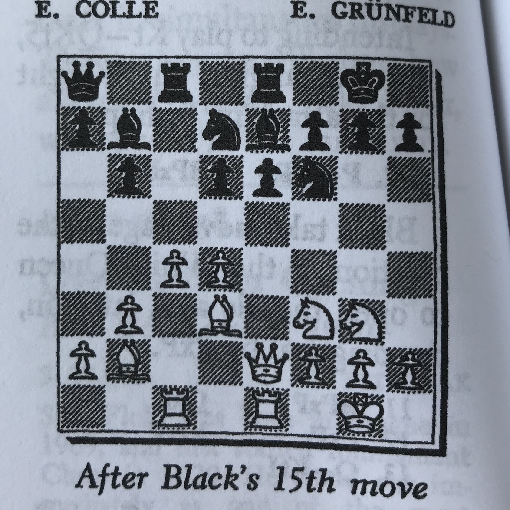

# Chess Vision - a computer vision chess project

This repository contains code and resources for extracting chess positions from images using computer vision algorithms. 
The project is built partly on another chess ocr program that can be found here: https://github.com/npcardoso/chessocr

## Example

This is what the program does:

Input: 


Output:


The above example mis-classifies a few squares, but does an OK job for now..

## Board extraction

Step 1 is to extract square chessboards from raw photographs of chess positions.

The command

```python board_extractor.py -d <indirname> -o <outdirname>```

populates the directory __outdirname__ with extracted board images. 

## Board rotation

The previous step leaves some of the extracted boards in a rotated orientation. 

Running 

```python rotate_boards.py```

in the __src__ directory sorts this out. 

## Square extraction

Square extraction is simply done by cutting the board images into 64 equal sized sub-images. 
Running 

```python extract_squares.py```

in the __src__ directory populates __data/squares__ with square images.


## Square classification


We classify squares by retraining a pretrained CNN on a hand-labelled dataset.

There are 12 different pieces on a chess board. They are:

  white: R, N, B, Q, K, P 
  black: r, n, b, q, k, p 

In addition, any square can be free (f).
Any piece can be posted on a white (w) or dark (d) square.

If we do not take into account square color, this turns out to be 13 classes.

The script ```hand_label.py``` lets the user hand-label every square image in the accumulated dataset into one of the 13 categories. 

Forever:
    show image
    wait for user-input... 
    record label

## Some references

+ https://github.com/ChessCV/chess
+ http://cvgl.stanford.edu/teaching/cs231a_winter1415/prev/projects/chess.pdf
+ http://www.raspberryturk.com/details/vision.html
+ http://vision.soic.indiana.edu/b657/sp2016/projects/rkanchib/paper.pdf
+ http://indigenousengineering.com/index.php/16-ie-project/10-extract-chess-position-from-an-image-using-image-processing-algorithms